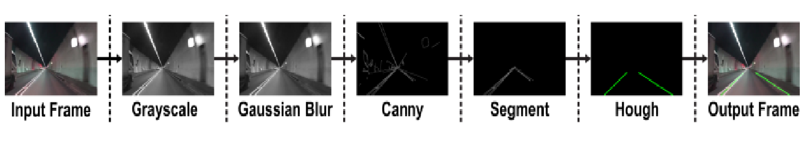

# Lane Detection using Hough Transform

A professional perception algorithm for lane detection in autonomous vehicle systems, utilizing classic computer vision techniques in Python.



## 📋 Overview

This project implements an end-to-end lane detection pipeline that identifies road lanes from both static images and video streams. By leveraging OpenCV, the algorithm processes visual data through several stages—from noise reduction to geometric transformation—to accurately overlay lane boundaries on the original footage.

## 🚀 Getting Started

### Prerequisites

- Python 3.7+
- pip (Python package installer)

### Installation

1. **Clone the repository:**
   ```bash
   git clone <repository-url>
   cd lane-detection
   ```

2. **Install dependencies:**
   ```bash
   pip install -r requirements.txt
   ```

### Usage

The main script is located in the `src/` directory. You can toggle between image and video processing by modifying the `MODE` variable in `src/lane_detection.py`.

Run the application:
```bash
python3 src/lane_detection.py
```

## 🛠 Technical Pipeline

The detection process follows a rigorous computer vision workflow:

1.  **Grayscale Conversion**: Simplifies the input image to a single channel to reduce computational complexity.
2.  **Gaussian Blur**: Applies a (5, 5) kernel to smooth the image and suppress high-frequency noise that could cause false edge detection.
3.  **Canny Edge Detection**: Identifies sharp gradients in intensity to pinpoint potential lane boundaries.
4.  **Region of Interest (ROI)**: Masks the image to focus only on the triangular area in front of the vehicle where lanes are statistically likely to appear.
5.  **Hough Transform**: Extracts straight lines from the edge-detected pixels by transforming them into the Hough space.
6.  **Linear Regression & Averaging**: Categorizes detected lines into left and right lanes based on their slopes and averages them to produce smooth, consistent lane markers.
7.  **Overlay**: Re-projects the detected lanes onto the original RGB frame with transparency.

## 📁 Repository Structure

```text
├── assets/
│   ├── images/         # Sample images and pipeline documentation
│   └── videos/         # Sample video footage for testing
├── src/
│   └── lane_detection.py   # Refactored source code
├── requirements.txt    # Project dependencies
└── README.md           # Project documentation
```

## 🧰 Tech Stack

*   **Python**: Core programming language.
*   **OpenCV**: Image processing and computer vision.
*   **NumPy**: High-performance array manipulation.
*   **Matplotlib**: Visualization and debugging.

---
*Original algorithm by Dhruv Pathak.*
